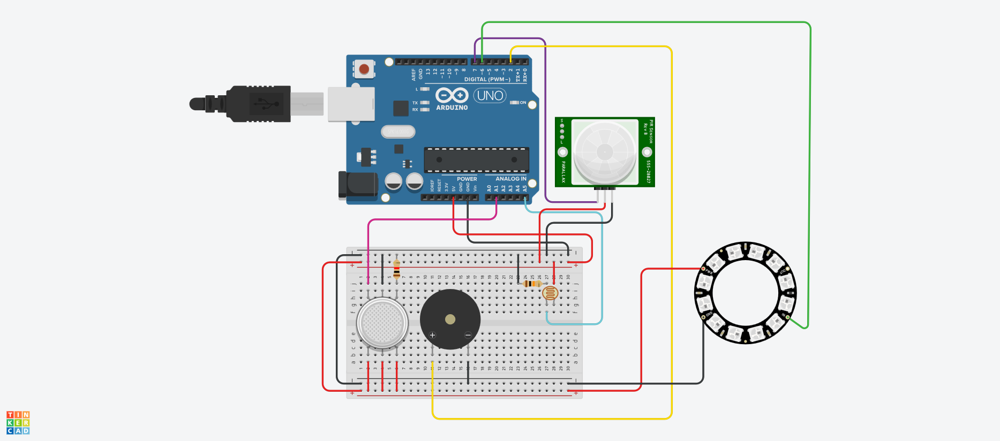

# Smart Safety System with Arduino and NeoPixel Ring

**Author:** Tomas Baublys  
**Course:** Introduction to robotics  

---

## Project Overview

This project implements a **smart safety system** using an Arduino, a NeoPixel LED ring, and multiple sensors:

- **Photoresistor** – detects ambient light levels.
- **Smoke detector** – monitors smoke levels to detect potential fire hazards.
- **PIR motion sensor** – detects motion in the environment.
- **Piezo buzzer** – provides audible alarms.
- **NeoPixel LED ring** – provides visual feedback (alarm and status).

The system continuously monitors the sensors and responds as follows:

1. **Smoke detected**:  
   - Red light on the NeoPixel ring.  
   - Piezo buzzer sounds an alarm.

2. **Low light & motion detected**:  
   - White-yellow light on the NeoPixel ring is turned on.

3. **No smoke or motion**:  
   - All LEDs are turned off.

---

## Hardware Setup

| Component              | Pin       |	     |
|------------------------|-----------|-------|
| Photoresistor           | A5       |INPUT  |
| Smoke Detector          | A1       |INPUT  |
| PIR Motion Sensor       | 7        |INPUT  |
| Piezo Buzzer            | 2        |OUTPUT |
| NeoPixel LED Ring       | 6        |OUTPUT |

- NeoPixel Ring contains **12 LEDs**.

## Circuit Diagram

---

## Software

- Written in **Arduino C++**.
- Uses the **Adafruit NeoPixel library** to control the LED ring.  

### Key Functions

- `setup()` – Initializes serial communication, sensor pins, and NeoPixel ring.  
- `loop()` – Reads sensor values and updates LEDs and buzzer based on conditions.

---

## Usage

1. Connect the hardware according to the pinout table or for more details refer to wirring.pdf.
2. Install the [Adafruit NeoPixel library](https://github.com/adafruit/Adafruit_NeoPixel) in Arduino IDE.
3. Upload the code to your Arduino board.
4. Observe the LED ring and buzzer respond to smoke, motion, and light conditions.

---

## Notes

- Adjust `PHOTO_RES_THRESHOLD_VAL` and `SMOKE_DET_THRESHOLD_VAL` to match your sensor calibration.
- The buzzer uses a 523 Hz tone for 500 ms when smoke is detected.
- The system can be extended with additional sensors or network alerts for more advanced safety systems.
